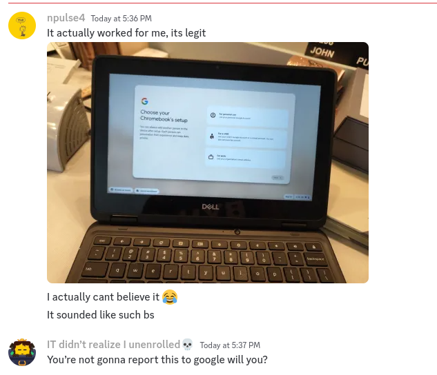
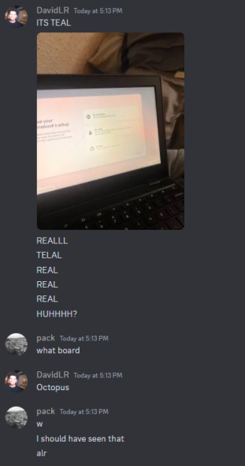
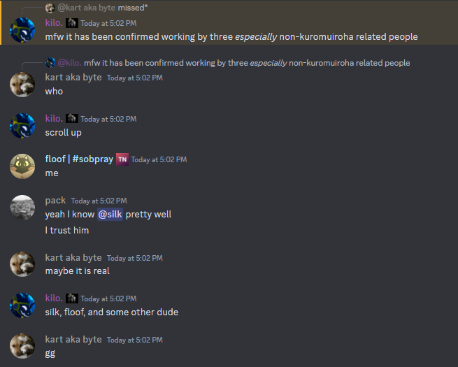

# IMPORTANT NOTE NUMBER TWO
test
People have actually unenrolled with this (including me, doxr, byte, peap and player_k12) in Bromine and we have chromeos logs of what happened when crshitty works so yeah this is not a troll don't be fooled. but I will say still take stuff in the repo with a grain of salt

# Important Note (original important note)

The creator (kelpseastem) has privated the original Repo and has said publicly that this was a troll. Now at first it makes sense because the steps are somewhat retarded. But then you realize, multiple people UNRELATED with "kiro" have said this actually worked and posted proof (cannot confirm if it they are real, but these accounts don't look like alt accounts)

Anyways, point is SOMETHING happened and it couldn't have been because of crsh2tty since thats fake; [Bromine35](https://github.com/entrpix) has actually been looking into similar cases of people exiting recovery mode and randomly unenrolling 
by accident and maybe this is connected so idk. Whether you believe it was actually a troll or not and decide to do it is your choice I guess, but take this entire repo with a grain of salt.

Original readme (and no, this isn't a fork of theskid22's repo this was forked from the original before it went down but its the same so yeah):

# CRSH2TTY
CRSH2TTY is a universal unenrollment method found by [@kelpseastem](https://github.com/kelpseastem) and [@Entrpix](https://github.com/entrpix).
1. [Guide](Docs/guide.md)
2. [Writeup](Docs/writeup.md)
3. [Theories](Docs/theories.md)
### Credits
original discovery & testing & writing docs - [@kelpseastem](https://github.com/kelpseastem)\
\
idea for & founder of kuromuiroha - [@Entrpix](https://github.com/entrpix)
# Original kajig
## CRSH2TTY - Universal unenrollment (tested v31-v128) (does not require USB)
CRSH2TTY is a universal unenrollment method, created by [@kelpseastem](https://github.com/kelpseastem) and [@Entrpix](https://github.com/entrpix).
##  How do I do it?
1. Powerwash (press `ctrl + alt + shift + r` on the login screen)
2. Proceed through setup as normal
3. When it starts to enroll, wait 2 seconds then restart by pressing `power + refresh`
4. When it starts to enroll again, wait 2 seconds and press `esc + power + refresh` then `power` to turn it off
5. Leave it off for ***at least*** 15 hours
6. When you turn it on, it should look like [this](https://github.com/kuromuiroha/CRSH2TTY/raw/main/Docs/Media/v128nissa.mp4) or something similar. You're unenrolled!
## Why is it called CRSH2TTY?
Why not?
## Is this patchable?
Probably
## New exploit group?
Yes!!!!!!!!!!!!!!!!!!!!!!!!!!!!!!!!!!!! https://discord.gg/2aPZREdn4y
## It doesn't work!!!!
Join our Discord server for support!!!!!! ^^^^^^^^^^^^^^^^^^^^^^^^^^
